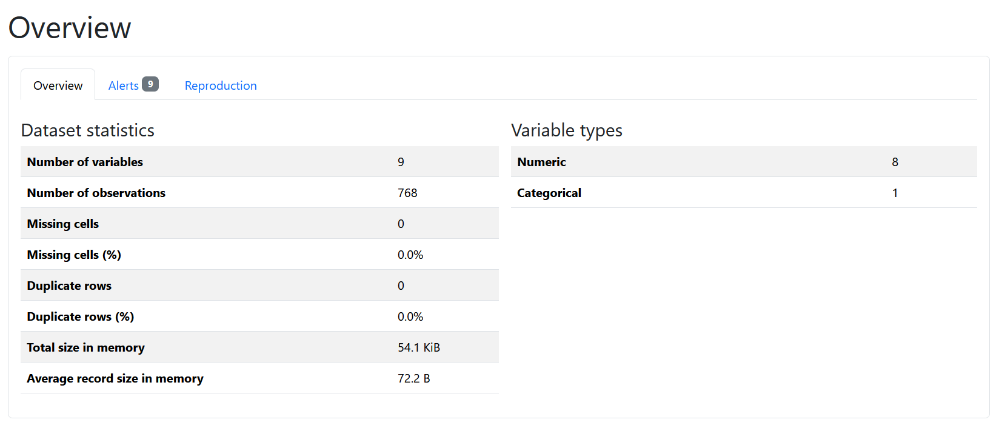
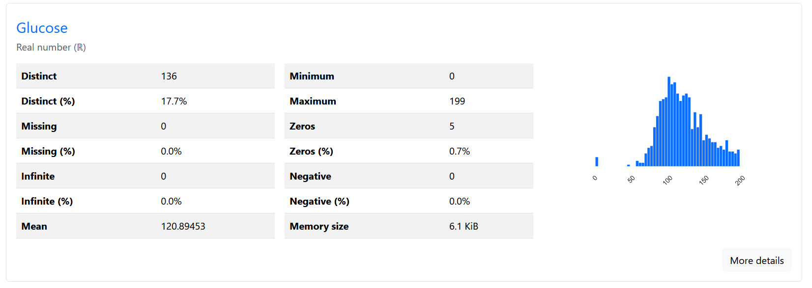
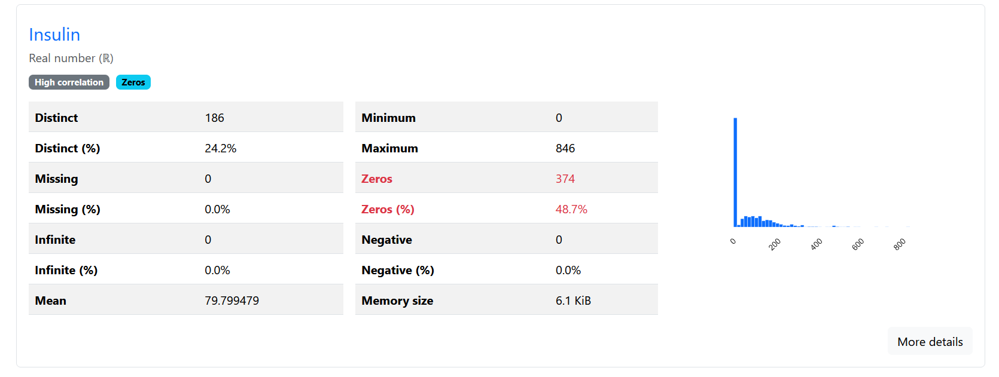
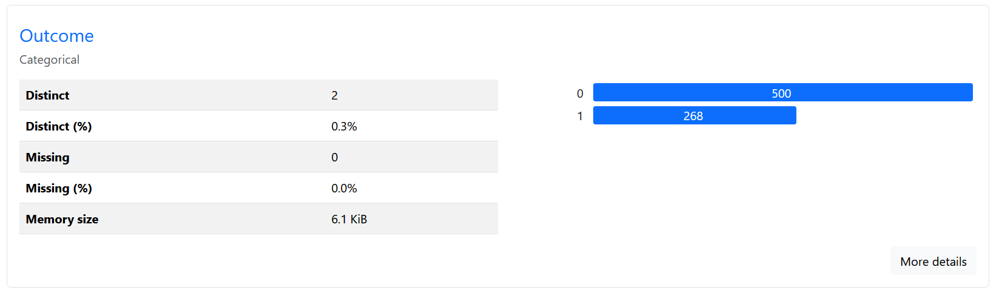
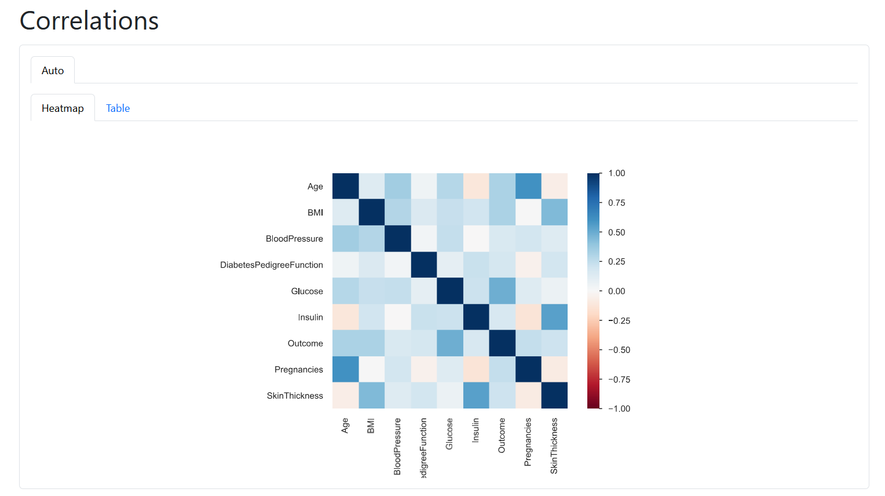
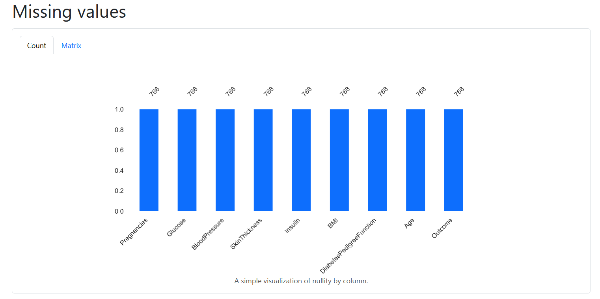
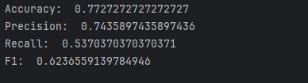
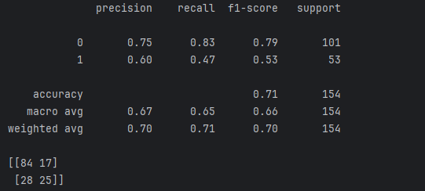
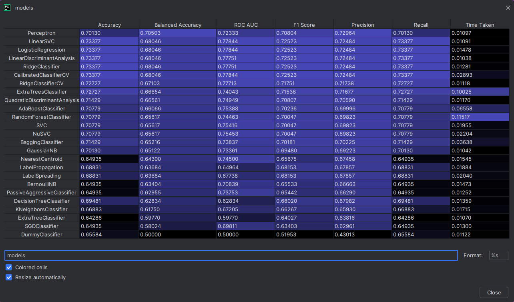

# Diabetes Classification with Machine Learning

## 1. Introduction
This project focuses on solving a binary classification problem using the Diabetes dataset. The objective is to build a machine learning model capable of predictingwhether a patient has diabetes based on medical features.

The workflow follows a standard machine learning pipeline, including data analysis, preprocessing, model training, and evaluation 

This is my weekly exercise in Data Science - Machine Learning Course.  
***
## 2. Dataset Description
The dataset consists of structured tabular data with:  
- Multiple input features (eg., glucose level, BMI, age, etc.)
- One target variable:
  - Outcome (0 = No diabetes, 1 = Diabetes)

Key observations: 
- TFeatures show low correlation with the target, indicating weak linear relationships
- Non-linear models are therefore mor suitable for this problem

***
## 3. Workflow Overview
The overall pipeline is structured as follows:
1. Data Loading (Pandas)
2. Data Analysis \& Visualization
3. Train/Test Split 
4. Data Preprocessing 
5. Model Training
6. Model Evaluation
7. Model OPtimization

***
## 4. Data Analysis
### Exploratory Data Analysis (EDA)
Statistics analysis and visualization are performed using:  
```python
from ydata_profiling import ProfileReport 
profile = ProfileReport(data, title="Diabetes Report") 
profile.to_file("diabetes_report.html")
```


This step helps to:
- Understand data distribution
- Detect missing values
- Analyze correlations betweem features and targets






---

## 5. Data Splitting
### Feature - Target / Label Split

```python
x = data.drop("Outcome", axis=1) y = data["Outcome"]
```
### Train - Test Split

```python
from sklearn.model_selection import train_test_split

x_train, x_test, y_train, y_test = train_test_split( x, y, test_size=0.2, random_state=42 
)
```
- randome_state ensures reproducibility
- Prevents variations across different runs
***

## 6. Data Preprocessing 
### Feature scaling

Scaling is applied to ensure fairness across features:

```python
from sklearn.preprocessing import StandardScaler 
scaler = StandardScaler() 
x_train = scaler.fit_transform(x_train) 
x_test = scaler.transform(x_test)
```

Key principles:
- fit() or fit_transform() is applied only on training data
- .transform() is applied to test data

---

## 7. Model Training
### Random Forest Classifier

```python
from sklearn.ensemble import RandomForestClassifier

model = RandomForestClassifier(random_state=200) 
model.fit(x_train, y_train)
```
- A non-linear model is chosen due to weak linear relationships in the dataset
- Model training is performed on the training set
---

## 8. Model Evaluation
Predictions are generated on the test set:
```python
y_predict = model.predict(x_test)
```
Evaluation metrics include:
- Accuracy
- Precision
- Recall
- F1-score

```python
from sklearn.metrics import accuracy_score, precision_score, recall_score, f1_score 

print("Accuracy:", accuracy_score(y_test, y_predict)) 
print("Precision:", precision_score(y_test, y_predict)) 
print("Recall:", recall_score(y_test, y_predict)) 
print("F1-score:", f1_score(y_test, y_predict))
```



Additional evalution tools:
- Classification report
- Confusion matrix



These metrix provide insight into model performance across both classes

---
## 9. Model Optimization
### Grid Search CV (Hyperparameter Tuning)

To improve performance, hyperparameters are optimized using GridSearchCV:

```python
from sklearn.model_selection import GridSearchCV 

params = { 
    "n_estimators": [50, 100, 200], 
    "criterion": ["gini", "entropy", "log_loss"], 
    "max_depth": [None, 3, 5, 7], 
} 

model = GridSearchCV( 
    estimator=RandomForestClassifier(random_state=200), param_grid=params, 
    scoring="recall", 
    cv=6, 
    n_jobs=-1 
)
```
- Performs exhaustive search over parameter combinatons
- Uses cross-validation for robust evaluation

---

## 10. Model Comparison

To evaluate multiple models efficiently, tools such as LazyPredict can be used:

- Automatically trains multiple models
- Ranks models based on performance metrics

This approach allows identification of the best-performing models before fine-tuning.




***

## 11. Results & Insights
- Non-linear models outperform linear models due to weak correlations
- Random Forest provides stable and reliable performance
- Hyperparameter tuning significantly improves model quality
- Proper data preprocessing is essential for fair model training


---

## 12. Requirement
- Python 3.13
- Pandas
- Matplotlib
- Scikit-learn
- ydata-profiling


---

## 13. Conclusion
A complete machine learning pipeline for classification has been implemented, including data analysis, preprocessing, mode training, and Optimization. The Results highlight the importance of model selection and proper evaluation techniques in achieving reliable predictive performance.


